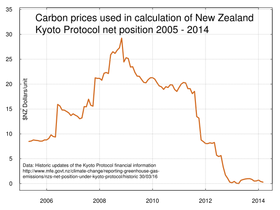
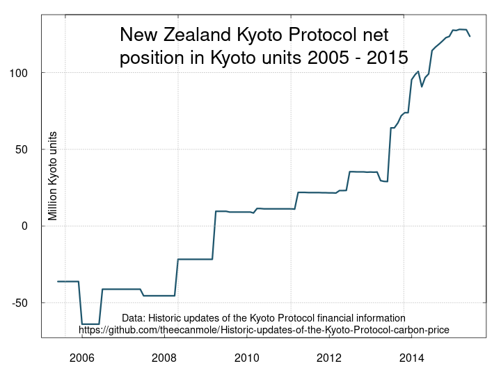

## Historic updates of the Kyoto Protocol carbon price 2005 to 2015 used by New Zealand's Ministry for the Environment.

New Zealand's obligation under the Kyoto Protocol (2008 to 2012) is currently only [very briefly mentioned on the Ministry for the Envronment's website](https://web.archive.org/web/20160415183825/http://www.mfe.govt.nz/node/16642)

Formerly, the Ministry for the Envronment's website featured [an introduction to New Zealand's net position under the Kyoto Protocol](https://web.archive.org/web/20160503022352/http://www.mfe.govt.nz/climate-change/reporting-greenhouse-gas-emissions/nzs-net-position-under-kyoto-protocol/about-net)

The webpage [Historic updates of the Kyoto Protocol financial information](https://web.archive.org/web/20160503020232/http://www.mfe.govt.nz/climate-change/reporting-greenhouse-gas-emissions/nzs-net-position-under-kyoto-protocol/historic) provided an updated month by month estimate of the New Zealand financial asset or liability under the Kyoto Protocol. This also included a data set of monthly international carbon prices converted to $NZ. This repository preserves that data set in a tidied public domain format.

Calculation and verification of the data is still available on this archived webpage [Carbon Price Information Releases](http://www.treasury.govt.nz/publications/informationreleases/carbonprice) from 2012.

This is a line chart of the carbon prices.

This is a line chart of the New Zealand Kyoto Protocol net position in emission units

This is a line chart of the New Zealand Kyoto Protocol net position expressed in $NZ millions 

###Index of files###

cer.html (the html of the Ministry for the Environment's web page "Historic updates of the Kyoto Protocol financial information")
nz-kyoto-cer-price-2005-2015.csv (the output data, the tidied monthlyCER price data)
cer.r (R script file of code to tidy the .html file)
Licence.txt           (Public Domain  Dedication and License v1.0 <a href="http://opendatacommons.org/licenses/pddl/1.0/">http://opendatacommons.org/licenses/pddl/1.0/>

