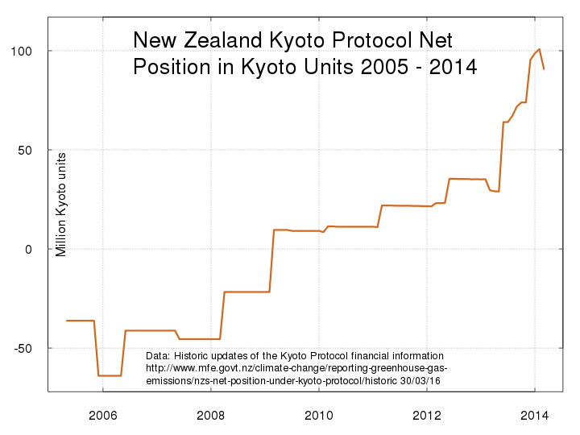

## Historic updates of the Kyoto Protocol carbon price 2005 to 2015 used by New Zealand's Ministry for the Environment.

This is an archived copy of [Historic updates of the Kyoto Protocol financial information](https://web.archive.org/web/20160503020232/http://www.mfe.govt.nz/climate-change/reporting-greenhouse-gas-emissions/nzs-net-position-under-kyoto-protocol/historic), a webpage of the New Zealand Ministry for the Envronment.

It sets out New Zealand's net position (a financial asset or liability) under the Kyoto Protocol. The page included a table of monthly international carbon prices converted to $NZ. This repository preserves that data set in a tidied public domain format. I saved the web page as an [html file](cer.html) then wrote some [R commands](cer.r) to make it into a [tidy dataframe](nz-kyoto-cer-price-2005-2015.csv).

There is [an introduction](https://web.archive.org/web/20160503022352/http://www.mfe.govt.nz/climate-change/reporting-greenhouse-gas-emissions/nzs-net-position-under-kyoto-protocol/about-net).

And a [background](https://web.archive.org/web/20160415183825/http://www.mfe.govt.nz/node/16642).

And information was on this New Zealand Treasury webpage [Carbon Price Information Releases](http://www.treasury.govt.nz/publications/informationreleases/carbonprice) from 2012.

1. [nz-kyoto-cer-price-2005-2015.csv](nz-kyoto-cer-price-2005-2015.csv) (the output data, monthly Certified Emission Reduction unit prices, currency conversion rate, New Zealand dollar carbon prices)

1. [New Zealand dollar carbon prices](nz-carbon-prices-2005-2015.csv) (only the date and New Zealand dollar carbon price)

1. [Google sheet of the tidy dataframe](https://docs.google.com/spreadsheets/d/1InAUrcccUdnNujuhbdsrJOZs0or8dydj9bIOllRG2WY/edit?gid=0)

1. [Google sheet of the table web-scraped from the archived web page](https://docs.google.com/spreadsheets/d/1GPw0cyPWK7X6oYklgpZEaLRwYjDU2YfcuCtCgUZTzWc/edit?gid=0) 

This is a line chart of the carbon prices from 2005 to 2015.

This is a line chart of the New Zealand Kyoto Protocol net position in emission units

This is a line chart of the New Zealand Kyoto Protocol net position expressed in $NZ millions 

## Index of files

1. [cer.html](cer.html) (the html of the Ministry for the Environment's web page "Historic updates of the Kyoto Protocol financial information")

1. [Google sheet of the table web-scraped from the archived web page](https://docs.google.com/spreadsheets/d/1GPw0cyPWK7X6oYklgpZEaLRwYjDU2YfcuCtCgUZTzWc/edit?gid=0)

1. [Google sheet of the tidy dataframe](https://docs.google.com/spreadsheets/d/1InAUrcccUdnNujuhbdsrJOZs0or8dydj9bIOllRG2WY/edit?gid=0)

1. [nz-kyoto-cer-price-2005-2015.csv](nz-kyoto-cer-price-2005-2015.csv) (the output data, the tidied monthly net position)

1. [New Zealand dollar carbon prices](nz-carbon-prices-2005-2015.csv) (only the date and New Zealand dollar carbon price)

1. [cer.r](cer.r) (R script file of code to tidy the data)

1. [NZ-Kyoto-Prices-720by540v2.svg](NZ-Kyoto-Prices-720by540v2.svg) 		chart of the carbon prices from 2005 to 2015

1. [NZ-Kyoto-Net-Units-720by540v2.png](NZ-Kyoto-Net-Units-720by540v2.png)	chart of the New Zealand Kyoto Protocol net position in emission units

1. [NZ-Kyoto-Net-Asset-720by540v2.png](NZ-Kyoto-Net-Asset-720by540v2.png)	chart of the New Zealand Kyoto Protocol net position expressed in $NZ millions

1. [Licence.txt](Licence.txt) (Public Domain  Dedication and License v1.0 <a href="http://opendatacommons.org/licenses/pddl/1.0/">http://opendatacommons.org/licenses/pddl/1.0/></ref>
